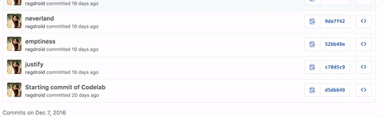

## Section 1 - Basic Spells

List of all the commits can be found [here] (https://github.com/ragdroid/rxify/commits/codelab). Copy the SHA of the commit "Starting commit of Codelab" 



Start by checking out the very-first commit of this interactive codelab SHA - `d5db64950f1616c308bb8174bb8dc01ab69971e8`. You can type the following command to checkout an SHA

```
git checkout d5db64950f1616c308bb8174bb8dc01ab69971e8
```
Open the file [`ChillPresenter`](app/src/main/java/com/ragdroid/rxify/codelab/ChillPresenter.java). This file is your playground, go crazy with the spells!

### [`just()`](http://www.reactivex.io/documentation/operators/just.html) - The Just-ify Spell
(SHA - `d5db64950f1616c308bb8174bb8dc01ab69971e8`)

> “create an Observable that emits a particular item”


```
Observable.just("Hello World!”);
```

 	
### `empty()`
(SHA - `d5db64950f1616c308bb8174bb8dc01ab69971e8`)
	
 - [`EmptyPresenter`](app/src/main/java/com/ragdroid/rxify/codelab/presenter/EmptyPresenter.java)
 - [`ErrorPresenter`](app/src/main/java/com/ragdroid/rxify/codelab/presenter/ErrorPresenter.java)
 - [`FromPresenter`](app/src/main/java/com/ragdroid/rxify/codelab/presenter/FromPresenter.java)
 - [`IntervalPresenter`](app/src/main/java/com/ragdroid/rxify/codelab/presenter/IntervalPresenter.java)
 - [`IntervalRangePresenter`](app/src/main/java/com/ragdroid/rxify/codelab/presenter/IntervalRangePresenter.java)
 - [`JustPresenter`](app/src/main/java/com/ragdroid/rxify/codelab/presenter/JustPresenter.java)
 - [`NeverPresenter`](app/src/main/java/com/ragdroid/rxify/codelab/presenter/NeverPresenter.java)
 - [`RangePresenter`](app/src/main/java/com/ragdroid/rxify/codelab/presenter/RangePresenter.java)
 - [`TimePresenter`](app/src/main/java/com/ragdroid/rxify/codelab/presenter/TimePresenter.java)